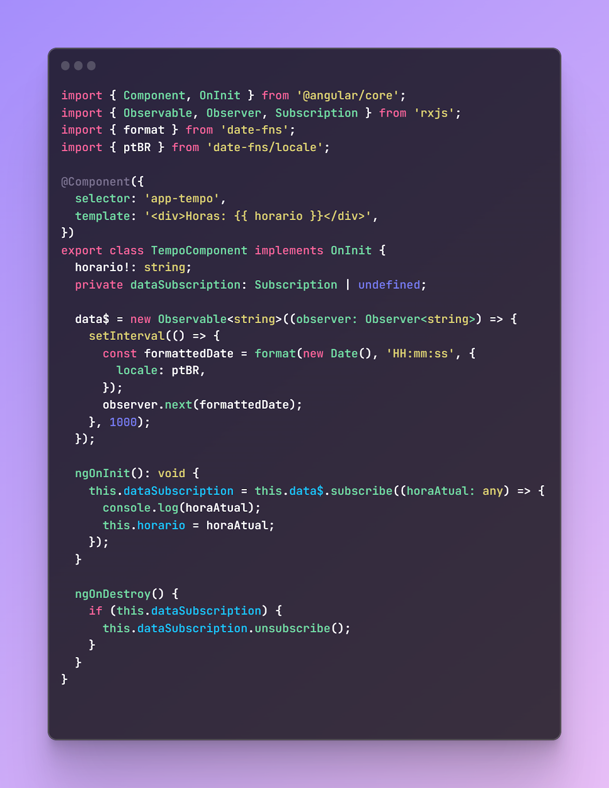
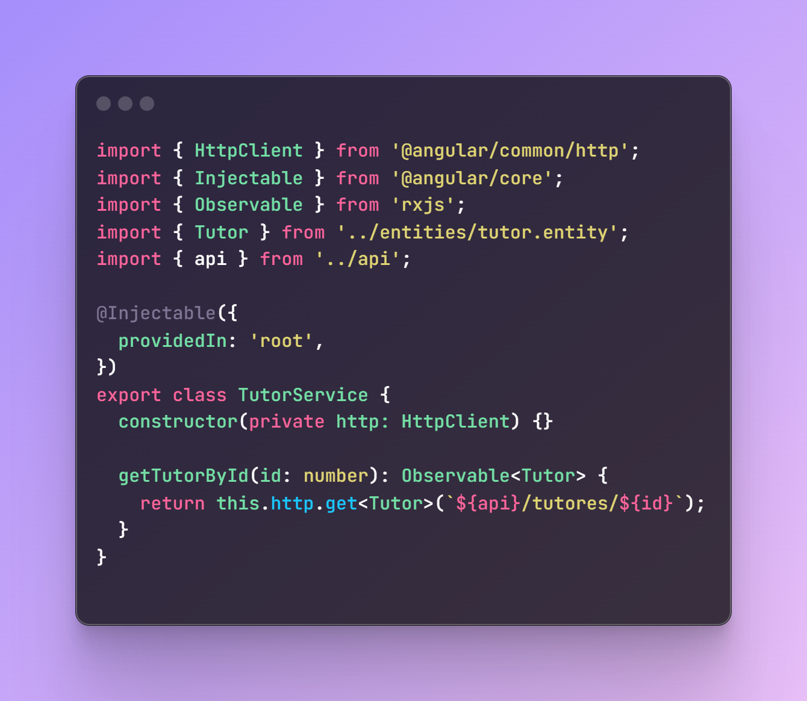
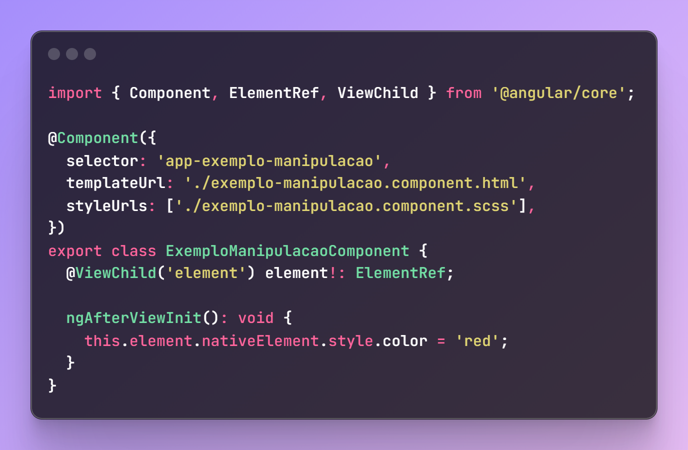

# CATÁLOGO DE BAD SMELLS EM APLICAÇÕES ANGULAR

## 1 Componentes com propriedades e funções duplicadas

A duplicação de código ocorre quando há trechos, métodos ou componentes que são idênticos ou muito semelhantes a outros dentro do mesmo projeto.
A razão pela qual a duplicação é ruim é porque a capacidade de manutenção do software é prejudicada, uma vez que as alterações precisam ser duplicadas. Então, naturalmente, faria sentido evitar a duplicação, de modo que, quando fizéssemos uma mudança no futuro, a mudança pudesse ser feita em um lugar e afetar outros automaticamente.

Suponha que exista 2 componentes semelhantes (serie.componente.html e filme.componente.html), que possuem propriedades e funcionalidades comuns entre eles. A Figura 1, corresponde ao arquivo serie.component.html, conteúdo HTML de um componente que exibe informações sobre uma série. Na Figura 2, contém o trecho de código HTML que exibe informações sobre um filme.

Figura 1

Figura 2

O problema no trecho de código apresentado anteriormente é que, se alguém tivesse que mostrar mais uma propriedade comum nos componentes, por exemplo o diretor da série ou do filme, você teria que adicioná-la em ambos os componentes, levando à duplicação de código.

Para evitar esse problema, pode ser criado um componente genérico contendo todas as propriedades comuns entre os componentes de série e filme. Então, o template ng-content é utilizado para criar um espaço reservado no componente genérico, onde pode ser adicionado as propriedades que não são comuns. A solução pode ser observada na Figura 3 que corresponde ao conteúdo HTML de um componente que exibe informações comuns a filmes e séries. A Figura 4 complementa a solução, correspondendo ao conteúdo TypeScript do componente genérico.

Figura 3

Figura 4

Com isso, basta adicionar o conteúdo exclusivo de cada componente dentro do componente genérico. Isso permite uma maior flexibilidade e reutilização do componente genérico em diferentes contextos. Na Figura 5, apresenta o trecho de código utilizado para exibir os dados do filme, fazendo uso do componente app-card, referente ao componente genérico. Ele passa um objeto filme para o componente genérico e também exibe a duração do filme. Na Figura 6, o mesmo pode ser feito com séries.

Figura 5

Figura 6

## 2 Não cancelamento de Observables

Quando se quer consumir dados assíncronos em uma aplicação Angular, uma forma é fazer uma inscrição em um observable. No entanto, ao se inscrever em um observable , continuar a escutá-lo mesmo após já terem feito uso dele. Deixar de cancelar a inscrição de um Observable quando um componente for destruído deixará essa assinatura aberta. Isso leva a vazamentos de memória no aplicativo. À medida que mais e mais Observables são adicionados a um aplicativo, mais aparentes se tornam os vazamentos de memória.

No exemplo a seguir, um observable é criado e uma inscrição é feita nele para continuamente obter a atualização da hora atual que fica sendo atribuída a variável horário que é usada para mostrar a hora para o usuário. A hora obtida pelo observable está sendo printada para facilitar a visualização do vazamento de memória.

Na Figura 7 contém o trecho de código abaixo, do arquivo tempo.component, que cria um observable que emite a hora atual formatada. $data é uma instância de um Observable que emite a hora a cada segundo. O ngOnInit é um método da interface OnInit que é chamada quando um componente é inicializado. Toda vez que o observable emitir um dado o método ngOnInit é chamado e ele faz a assinatura no observable $data com o método subscribe para poder consumir os dados dele e atualizar o valor da variável horário.

Figura 7

Para evitar vazamentos de memória, sempre deve-se desinscrever os observables após ter terminado de usá-los. É possível se desinscrever utilizando o método ngOnDestroy e o unsubscribe.
Na Figura 8, contém um trecho de código que é uma ampliação do código anterior, incluindo agora um método ngOnDestroy que é usado para fazer a desinscrição de um observable com a ajuda do método unsubscribe antes que o componente seja destruído, por exemplo, durante a navegação para outras rotas.

Figura 8

Outra maneira, ainda melhor, de lidar com assinaturas é usando o operador async para se inscrever automaticamente no observable no template. Isso deixa o código mais simples, coeso e não apresenta vazamentos de memória, pois não há necessidade de se preocupar em fazer manualmente a inscrição e desinscrição do observable.

A Figura 9, contém o arquivo tempo.component.ts, apresenta uma abordagem mais simplificada do código anterior. data$ é uma instância de Observable, mas ao contrário do exemplo anterior não há necessidade dos métodos para fazer a inscrição e desinscrição, pois ao usar a diretiva async no template ela automaticamente se inscreve e desinscrever do observable.

Figura 9

## 3 Sem trackBy em \*ngFor

Existem muitas práticas ruins que influenciam negativamente o desempenho do tempo de execução, e uma delas é a detecção de alterações. No Angular cada aplicação é representada como uma árvore de componentes e esta árvore será percorrida cada vez que uma alteração acontecer (Silldorff, 2023).
Um motivo que pode influenciar negativamente no desempenho é a falta da utilização do trackBy na diretiva *ngFor, que é uma diretiva utilizada para renderizar itens de uma lista em um template HTML.
O trackBy é uma função usada para rastrear os elementos de uma lista. Ao usar trackBy com *ngFor, o Angular saberá qual elemento foi alterado e só fará alterações no DOM para o elemento específico. (freecodecamp, 2018).
Na Figura 19, contém o arquivo app.component.ts que possui a declaração de uma lista de itens e na Figura 20 está sendo utilizado o \*ngFor para itera sobre a lista no template HTML.

Figura 10

Figura 11

Contudo, da forma como está implementado a detecção de alteração irá fazer com com que todos os itens sejam renderizados novamente. A solução é utilizar trackBy na diretiva *ngFor, dessa forma, os itens que não foram modificados não serão renderizados novamente. Na Figura 12 contém o componente AppComponent agora com a adição da função trackByFn, que será chamada pelo Angular para rastrear os itens quando for fazer a renderização. Na Figura 13 contém o *ngFor com trackBy que fornece uma função trackByFn que ajuda o Angular a identificar os itens modificados.

Figura 12

Figura 13

## 4 Componentes grandes/complexos

Às vezes, ao iniciar um projeto, principalmente quando se é iniciante em uma tecnologia, há uma tendência de começar a escrever todas as funcionalidades que podem ser necessárias em um mesmo componente/arquivo. Isso pode fazer com que o código fique cada vez mais grande e complexo, assumindo muito mais responsabilidade do que deveria. Com o passar do tempo, nosso código pode ficar muito difícil de dar manutenção, além da possibilidade de duplicação de código, caso se queira usar algum método do arquivo/componente, mas ele já está muito acoplado com outro método. Futuramente, pode ser necessário fazer retrabalho para desacoplar o código, o que pode levar muito tempo para ser feito.

Um arquivo/componente com muitos métodos, muitas injeções de dependências e muitas responsabilidades diferentes, assim como muitas linhas de código, são grandes indicadores de um componente/arquivo grande e/ou complexo. Não há um limite absoluto para o que é considerado "grande" ou "complexo". O importante é manter o código organizado, bem estruturado e fácil de manter. Se um componente está começando a parecer grande e/ou complexo, pode ser uma boa ideia considerar a refatoração para dividi-lo em componentes menores e mais gerenciáveis.

A melhor solução para isso é, desde o início do projeto, o código já ser pensado no possível escalonamento, e os métodos e componentes já serem criados desacoplados uns dos outros, seguindo os princípios de SOLID, melhorando assim a leitura e a manutenção futura do código.

## 5 Falta de tipagem forte

A falta de tipagem forte pode levar a problemas quando se trata de identificar erros de tipo, como também dificultar o processo de desenvolvimento, tendo em vista que, ao não saber o que exatamente uma função retorna ou quais são as propriedades de um um objeto, há a possibilidade de o projeto em desenvolvimento atrasar, pois o desenvolvedor pode não ter conhecimento de que tipo de dados eles esta mexendo. Além disso, deve-se sempre definir todos os tipos para cada dado que recebe, porque, afinal, é por isso que o Angular optou por ser usado principalmente no TypeScript. (Vardanyan, 2017).

Na Figura 14, mostra o componente responsável por lidar com a exibição de uma lista de pets. Nela a variável pets é declarada como sendo uma lista do tipo Observable<any[]>. No construtor é injetado o serviço PetService que é utilizado dentro do método ngOnInit, onde o método getPets é chamado e é atribuído o retorno a variável pets.

A Figura 15, contém o template HTML que exibe a lista de pets. A diretiva \*ngFor é permite percorrer o array de pets para pegar as propriedades do pet. Contudo a propriedade tutor não existe em pet, mas o desenvolvedor não tem conhecimento disso, por causa da falta de tipagem forte no código, que apresentaria o erro avisando que a propriedade não existe. Como pode ser visto na Figura 16, não aparece o nome do tutor, dado que a propriedade não existe.

Figura 14

Figura 15

Figura 16

Na Figura 17, está o código do componente PetsCompoent refatorado e agora a variável pets será do tipo Observable<Pet[]> e como essa nova versão conta com uma interface com as propriedades que o pet irá possuir, o desenvolvedor terá o conhecimento de que a propriedade tutor não existe. Dessa forma, como pode ser visualizado na Figura 27, pode se notar que há um sinal embaixo do tutor, então o desenvolvedor terá a noção do erro durante o tempo de desenvolvimento.

Figura 17

Figura 27 - Template HTML que exibe a lista de pets, onde pode se notar um sinal de erro embaixo do tutor

Fonte: Do autor (2024)

## 6 Assinaturas aninhadas

Aninhar assinaturas é algo que precisa ser evitado tanto quanto possível. Torna o código ilegível, complexo e pode resultar em efeitos colaterais. Um cenário comum é usar valores de um obsevable. para recuperar valores de outro. O problema com o aninhamento de assinaturas é que a primeira assinatura não tem controle sobre as assinaturas aninhadas, o que pode levar a dados incompatíveis, além de vazamentos de memória devido a assinaturas não tratadas.

A solução é usar operadores de transformação como mergeMap, concatMap ou switchMap. Usar esses operadores faz com que o observável externo gerencie o observável interno, incluindo assinaturas e cancelamentos. O principal benefício de gerenciar assinaturas dessa maneira é que dessa forma não há possibilidade de dados incompatíveis.

Na Figura 19, apresenta o código onde é definido uma interface que estende às entidades de Pet e Tutor chamada PetWithTutor, ela serve para que se tenha conhecimento de que tipo de dados está sendo utilizado. A classe PetsComponent contém uma variável chamada petsWithTutors, e também possui instâncias no construtor das classes de serviço PetService e TutorService. Possui também um método ngOnInit que é executado quando o componente é inicializado, e contém toda a lógica para se pegar os dados do pet e seu tutor. É usada a função getPets do serviço petService para obter uma lista de pets. Como a função retorna retorna um observable é utilizado o operador de assinatura subscribe, que faz a inscrição no observable para receber os dados, nela possui uma função callback que é chamada quando a lista de pets é emitida. Dentro da função callback a lista de pets é iterada utilizando o método map e para cada pet é chamada a função getUserById do serviço tutor Service passando por parâmetro o id do tutor que é pago a partir do pet. A função getTutorById também retorna um observable e nele também é feita a inscrição para que seja possível pegar os dados dele também. Quando as informações do tutor são emitidas, a função de callback é chamada, e dentro da função callback as informações do pet e de seu tutor são adicionadas dentro do array petsWithTutors.

Figura 19

Já na Figura 20, é usado também a função getPets assim como na versão do código anterior, porém agora é usado o operador switchMap é usado para mudar para outro observable quando um novo valor chega, pois ele esquece o observable anterior em que estava inscrito e muda para outro. (Bashika, 2023). O switchMap possui uma função callback onde é utilizado o forkJoin que é um operador que esperar que todos os observable ​​passados ​​sejam emitidos e concluídos e então emite um array ou um objeto com o valor resultante da combinação dos dados de tutor e pet. (RxJS, 2018) Por fim, é feita uma inscrição no observable resultante para receber os dados combinados dos pets com seu tutor, e então, o valor é atribuído à variável petsWithTutors.

Figura 20

Na Figura 21, contém a classe de serviço PetService, onde em seu construtor é injetado o HttpClient que é usado para fazer requisições HTTP. Na classe também tem a função getPets, que faz a requisição de pets para a api. A Figura 22, contém a classe de serviço TutorService que também é injetado em seu construtor o HttpClient e possui a função getTutorById que recebe o id do tutor como parâmetro e faz a requisição dos dados do tutor pelo id.

Figura 21

Figura 22

Na Figura 23, apresenta o trecho de código HTML utilizado para exibir os dados dos pets e o nome de seu tutor.

Figura 23

## 7 Método/função no modelo HTML

A detecção de alterações do Angular é executada sempre que ocorre um evento no navegador. Quando o Angular for verificar se há atualizações em sua árvore de componentes, se tiver métodos nos modelos HTML, a única maneira do Angular ver se a saída desse método mudou é chamá-lo novamente, o que tem um impacto negativo no desempenho. Uma solução é usar vinculação de propriedade.
Na Figura 24, há uma tag HTML ‘p’ com uma frase para ser exibida. É usado a sintaxe espacial ‘{{}}’ chamada interpolação que permite inserir valores de variáveis dentro do html. Neste exemplo está sendo inserido a função getCity que vai retornar o nome da cidade para ser exibida, e na Figura 25, há o código do componente, onde é injetado um serviço para ser usado no método getCity para buscar o nome da cidade que será exibido no HTML.

Figura 24

Figura 25

A vinculação de propriedade (Property Binding) é um dos recursos mais utilizados do Angular, é essencial para exibir informações no DOM. Quando se atribui um valor simples a uma propriedade , não há necessidade de realizar a detecção de alteração repetidas vezes para verificar se o valor foi alterado. (Herrera, 2020).

Na Figura 26, apresenta a versão modificada do template HTML anterior, porém, agora é usado vinculação de propriedade em vez de chamar o método, e na Figura 27, tem o componente CityComponent refatorada, com o método ngOnInit que é responsável por chamar o método getCity do serviço e atribui a variável city que será usada no HTML .

Figura 26

Figura 27

## 8 Manipulação de dom

O Angular tem suas próprias maneiras de lidar com a manipulação de DOM. O framework Angular usa-se de arquitetura baseadas em componentes, manter a forma como a tecnologia foi feita para ser usada com a manipulação de dom pode levar a complexidade desnecessária de código.

De acordo com a documentação do Angular, permitir acesso direto ao DOM pode tornar a aplicação mais vulnerável. É recomendado aproveitar os recursos fornecidos pelo framework para manipulação de DOM e de eventos. Isso ajudará a manter uma base de código mais limpa e fácil de manter, além de aproveitar as vantagens dos recursos e otimizações de desempenho oferecidos pela tecnologia.

O nativeElement é um recurso utilizado pelos desenvolvedores quando sentem a necessidade de fazer alguma manipulação direta no DOM, porém é aconselhável pela própria documentação que seja utilizada como último recurso. Na Figura 28, é possível ver um exemplo de como o nativeElement é usado para realizar as modificações. Nele é declarada uma propriedade chamada element do tipo ElementRef que fornece acesso às suas propriedades e métodos de um elemento DOM. É feito uso do decorator ViewChild que permite acessar um elemento do DOM no componente. Na classe do componente há também um método de ciclo de vida do Angular o ngAfterViewInit, que é chamado assim que inicia as visualizações do componente e seus filhos. No ngAfterViewInit é feita a manipulação de DOM para se mudar a cor do texto para vermelho com o `this.element.nativeElement.style.color = 'red'` que é o equivalente a `document.getElementsByClassName("title")[0].style.color = 'red'` em JavaScript simples.

Figura 28

A Figura 29, apresenta uma forma melhor de se fazer a manipulação de dom de uma forma mais segura, fazendo uso do recurso Renderer2. O Renderer2 é injetado no construtor do componente e o no metodo ngAfterViewInit, nessa versao, é usada a propriedade injetada renderer para usar o método setStyle que aceita três argumentos, o nativeElement, a propriedade do elemento manipulado e o valor a ser atribuído à propriedade.

Figura 29

## 9 Herança

A herança é uma prática ruim, porque as classes que herdam das classes pai tendem a herdar mais do que precisam (Billiet, 2023). Se o sistema tiver uma classe LoginClientComponent que necessita de funcionalidades como login e loginGoogle e se no sistema também conter a classe LoginAdminComponent que só faz uso da funcionalidade login, então as duas classes estender da mesma classe pai se torna uma prática ruim, já que só há uma razão para se usar herança em projetos Angular: Quando todas as classes filhas precisam de toda a funcionalidade de nossa classe base. (Billiet, 2023).

Na figura 30, apresenta o código da classe pai LoginComponent que tem injetado em seu construtor o serviço de login LoginService, as variáveis email e senha e os dois métodos de usados para acessar o sistema, login e loginGoogle. Já na Figura 31 está a classe LoginAdminComponent estendendo da classe pai LoginComponent e na Figura 32, a classe LoginClientComponent que faz o mesmo que a classe anterior.

Figura 30

Figura 31

Figura 32

Uma forma de resolver isso é separando os métodos em serviços, assim as classes só teriam acesso aos métodos que elas precisam. A Figura 33, apresenta a classe LoginClientComponent refatorada. Nela agora são injetados dois serviços LoginEmailPasswordService e LoginGoogleService que são usados para se ter acesso ao método de autenticação com email e senha e com o google. Na Figura 34 se encontra a classe LoginAdminComponent que possui apenas um serviço injetado, já que ela só faz uso de um dos métodos de autenticação.

Figura 33

Figura 34

